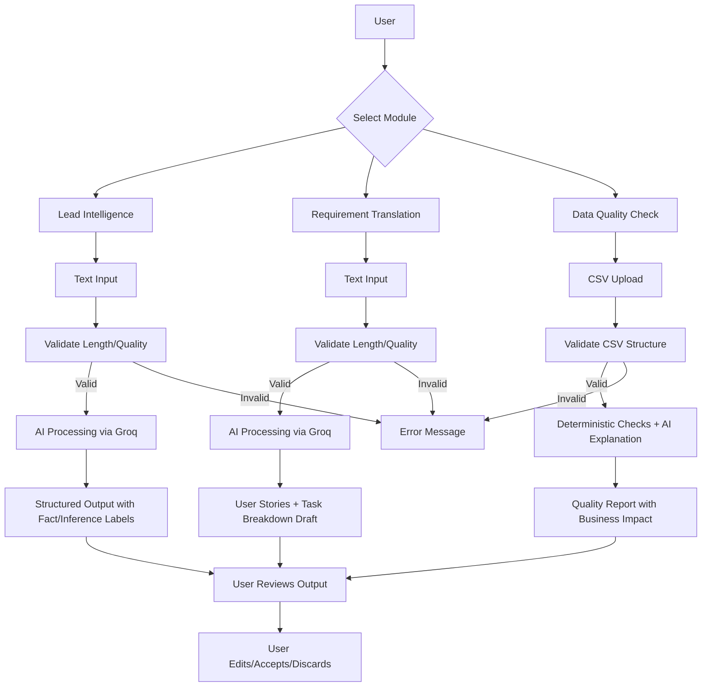

# System Flow Documentation

## Overview

The AI Assist Toolkit follows a consistent processing pattern across all three modules:

```
User Input → Validation → Processing → Output with Review Markers
```

## End-to-End Flow



## Module-Specific Flows

### Module 1: Lead Intelligence

```
Input: Free-text (emails, notes, transcripts)
   ↓
Validation: Min 50 chars, max 15,000 chars, text quality check
   ↓
AI Processing: Groq/Llama 3.3 70B with structured prompt
   ↓
Output Structure:
   - Business Summary
   - Explicit Pain Points (OBSERVED - quoted from input)
   - Inferred Client Intent (LABELED as inference)
   - Suggested Next Actions
   - Uncertainty/Missing Information
```

### Module 2: Requirement Translation

```
Input: Discovery notes, client messages
   ↓
Validation: Min 50 chars, max 15,000 chars
   ↓
AI Processing: Strict prompt with exclusion rules
   ↓
Output Structure:
   - User Stories (As a... I want... So that...)
   - Acceptance Criteria (Plain language, testable)
   - Task Breakdown (Logical decomposition)
   - Clarifications Needed
   - Explicit Exclusions (timelines, assignments, architecture)

[DRAFT - REQUIRES HUMAN REVIEW watermark]
```

### Module 3: Data Quality Check

```
Input: CSV file upload
   ↓
Validation: File structure, row/column limits
   ↓
Deterministic Checks (NO AI):
   - Missing fields per column
   - Duplicate records (exact + potential)
   - Format inconsistencies (email, phone)
   - Basic anomalies (short text, negative numbers)
   ↓
AI Explanation (Groq):
   - Why each issue matters
   - Downstream business risks
   - Cleanup priority recommendations
   ↓
Output: Quality report with severity levels

[READ-ONLY - No data modified notice]
```

## AI vs Deterministic Processing

| Check Type | Module 1 | Module 2 | Module 3 |
|------------|----------|----------|----------|
| Input Validation | Deterministic | Deterministic | Deterministic |
| Content Analysis | AI | AI | Deterministic |
| Output Generation | AI | AI | Deterministic + AI Explanation |
| Data Modification | Never | Never | Never |

## Error Handling Flow

```
Any Error Condition
   ↓
Check Error Type:
   - Input too short → User-friendly message with guidance
   - Input too long → Truncation suggestion
   - Invalid file → Format requirements explanation
   - API unavailable → Graceful fallback message
   - Rate limited → Retry guidance
   ↓
Display Error in UI (no silent failures)
```

## Session Data Flow

```
User Session Start
   ↓
Initialize Empty Session State
   - lead_input: ""
   - req_input: ""
   - dq_df: None
   ↓
User Interactions (in-memory only)
   ↓
Session End or Browser Close
   ↓
All Data Discarded (no persistence)
```
